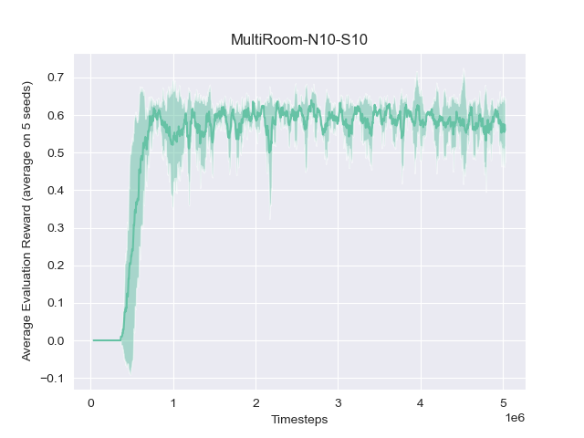
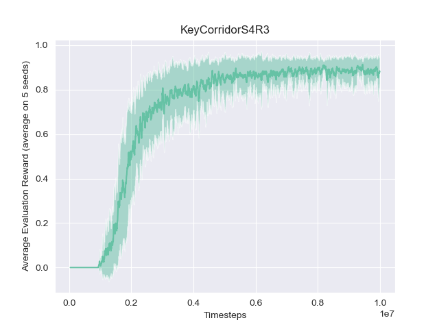
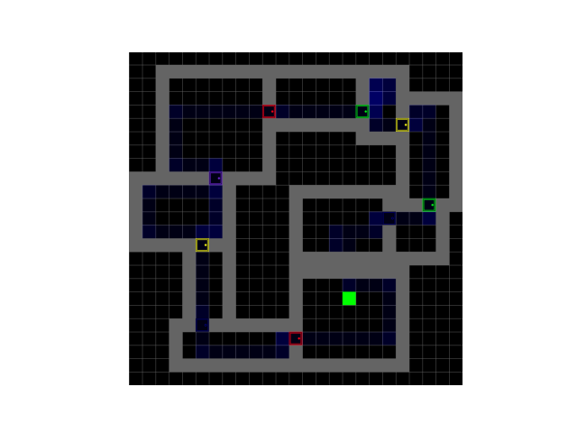
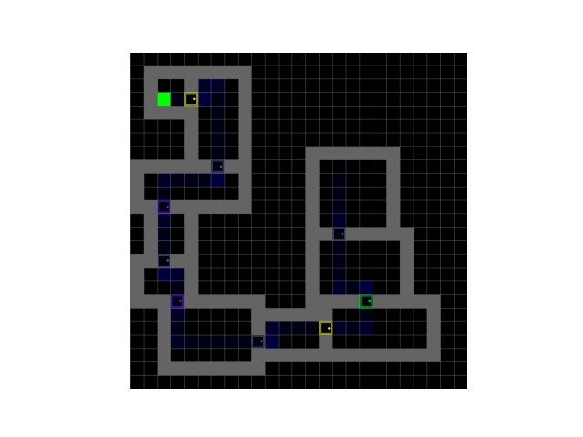

# Pytorch-based Implementation of AGAC

This is a Pytorch-based implemention of the Adversarially Guided Actor Critic (AGAC). It supports parallelization via MPI, and logging via Neptune.

Change the username and project name in the configuration file `agac_torch/configs/minigrid.yaml`:

```
"logging":
    ...
    "experiment_name": "AGAC-MiniGrid"
    "neptune_user_name": "YOUR_USER_NAME"
    "neptune_project_name": "YOUR_PROJECT_NAME"
```
and launch an experiment:
```
python agac_torch/run_agac_experiment.py \
    --config-path agac_torch/configs/minigrid.yaml \
    --env-name=MiniGrid-MultiRoom-N10-S10-v0 \
    --seed 123
```
To launch several actors in parallel with `mpi4py`:
```
mpiexec -n 4 python agac_torch/run_agac_experiment.py \
    --config-path agac_torch/configs/minigrid.yaml \
    --env-name=MiniGrid-MultiRoom-N10-S10-v0 \
    --seed 123
```

## Results

Mean and standard deviation of the evaluation reward on 5 seeds for the 2 MiniGrid environments `MiniGrid-MultiRoom-N10-S10-v0` and `MiniGrid-KeyCorridorS4R3-v0`. 

|   | |
| ----------- | ----------- |
|       |        |

## Visualize the agent's trajectory on Neptune:
For MiniGrid environments, change the `log_grid` parameter to `True` in the configuration file. 
```
"logging":
    ...
    "log_grid": True
```

And visualize the agent's evaluation trajectories in the `grid_coverage` field on Neptune.

|  Examples of evaluation trajectories on the `MiniGrid-MultiRoom-N10-S10-v0` environment. :|  |
| ----------- | ----------- |
|       |        |